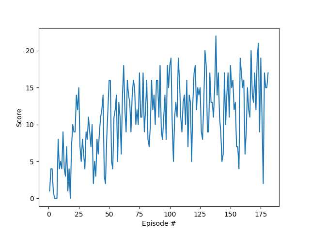

## DRL - Double DQN - Navigation Control

### Model Architecture
The Udacity provided Deep Q-Network code in PyTorch was used and adapted for this environment. 

The deep neural networks used for this problem has the following struture:
 - Hidden: (state_size, 64)      - ReLU    
 - Output: (64, action_size)     - Linear  

### Hyperparameters
- Alpha: 1
- Gamma: 0.99
- TAU: 1e-3
- Update Every: 1
- Batch Size: 128
- Buffer Size: 1e5
- Learning Rate: 5e-4 

## Results and Future Work
The solution for the task can be reached with around 200 episodes in average.

The future goal is to use the Duelling Deep Q-Learning and check how it goes in comparison with the actual solution.
I also want to check the "exploitation vs. exploration" question working with a variable epsilon. For this case
the epsilon is fixed into 5%. I think the convergence may increase with a decreasing exploration ratio.